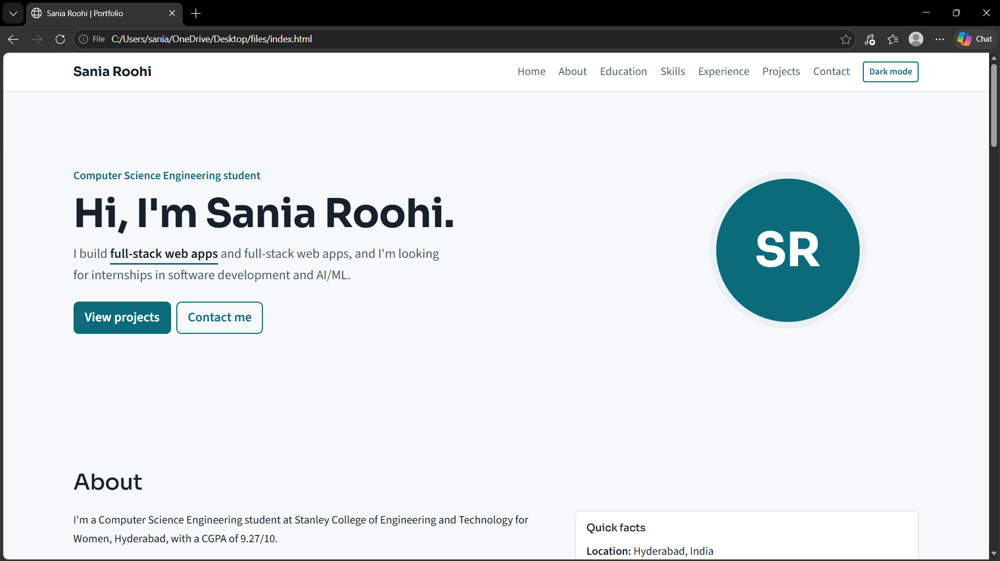
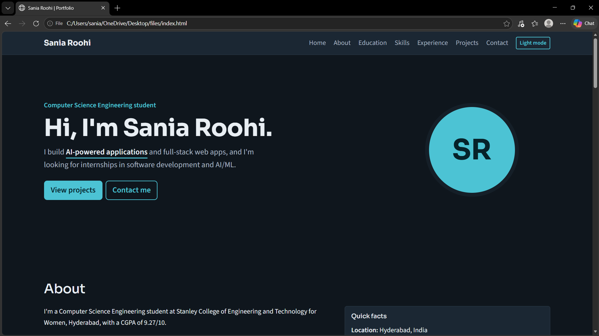

# Sania Roohi | Personal Portfolio

A responsive, accessible personal portfolio web application showcasing my profile, education, skills, internships, projects and contact details. Built for the Web Technologies assignment using HTML5, CSS3, Bootstrap 5 and ES6+ JavaScript.

## Screenshots

| Desktop (light) | Desktop (dark) |
|---|---|
|  |  |

## Features

- Sections: Home, About, Education, Skills, Experience, Projects, Contact
- Light and dark theme toggle, remembered between visits
- Project filtering by category (AI / ML, Full-stack, Backend / CLI)
- Rotating hero headline text
- Contact form with live validation and dynamic success/error alerts
- Fully responsive, mobile-first layout

## How it meets the assignment requirements

| Task | Implementation |
|---|---|
| 1. HTML5 structure | Semantic `nav`, `main`, `section`, `article`, `footer`; headings, lists, links, an education table and a contact form |
| 2. CSS3 and responsive design | CSS variables, box model, typography, Flexbox/Grid, mobile-first media queries, dark theme |
| 3. Bootstrap UI | Navbar, grid, cards, buttons, forms, table, alerts and scrollspy |
| 4. JavaScript interactivity | ES6+ (`const`/`let`, arrow functions, arrays of objects, template literals), DOM manipulation, loops and conditions; theme switching, project filtering, rotating text |
| 5. Validation and integration | Event handling, per-field validation (name, email, subject, message), error and success alerts with Bootstrap, accessible and consistent design |

## Tech stack

HTML5, CSS3, Bootstrap 5.3 (CDN), JavaScript (ES6+), Google Fonts (Sora, Source Sans 3)

## Project structure

```
portfolio/
├── index.html
├── README.md
├── css/
│   └── style.css
├── js/
│   └── script.js
└── screenshots/
```

## Run locally

1. Clone the repository: `git clone https://github.com/saniaroohi/Portfolio-Website.git`
2. Open `index.html` in any modern browser (internet needed for the Bootstrap and font CDNs).

## Accessibility

Skip-to-content link, semantic landmarks, ARIA labels and live regions for form messages, visible keyboard focus, sufficient colour contrast in both themes, and reduced-motion support.

## Author

**Sania Roohi**, Computer Science Engineering student, Hyderabad
Email: saniaroohi3@gmail.com | [LinkedIn](https://www.linkedin.com/in/sania-roohi-036942339) | [GitHub](https://github.com/saniaroohi)
